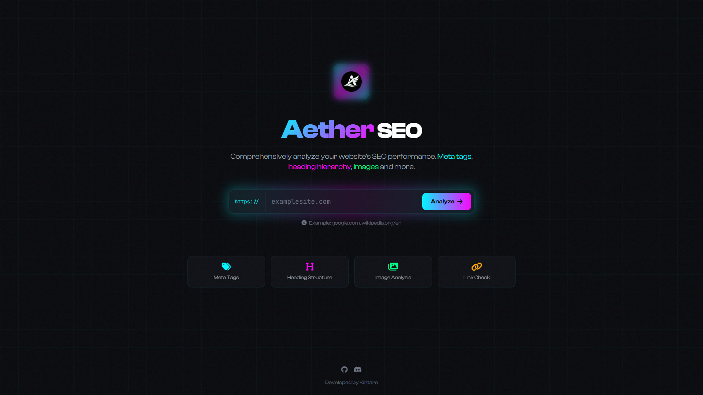
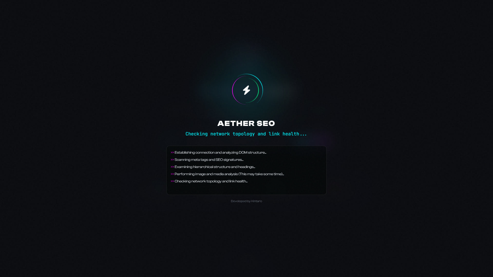
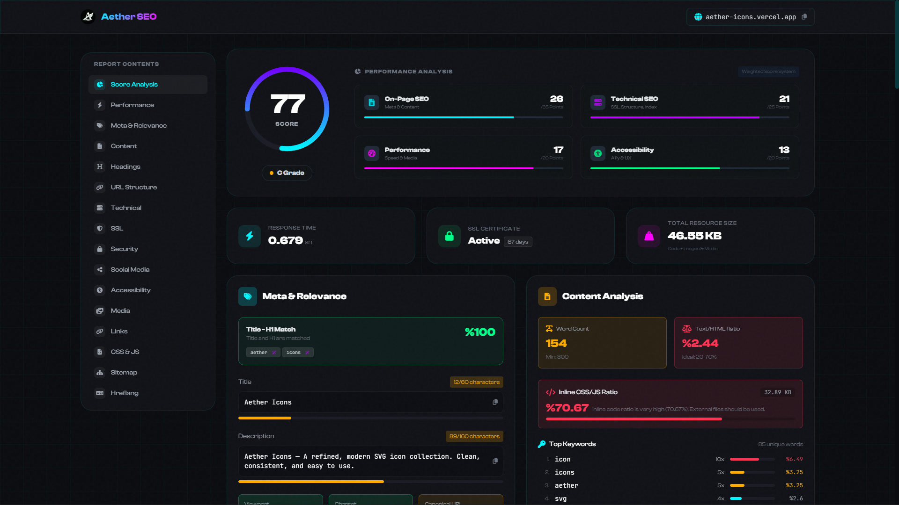
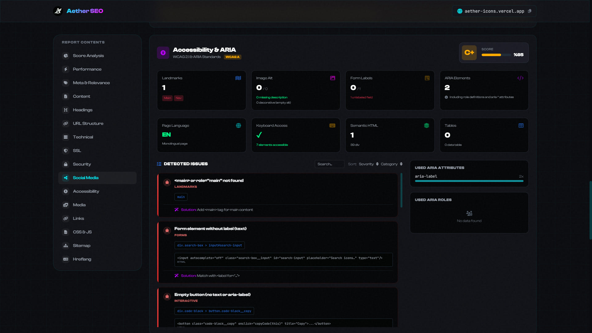

<a href="README.md">
  
</a>
<a href="README-TR.md">
  
</a>

  <br />
  <br />

<div align="center">
  
  <br />
  <br />

  <p>
    Akıllı ve Kapsamlı SEO Analiz Aracı
  </p>


  <p>
    <a href="#features">Özellikler</a> •
    <a href="#technologies">Teknolojiler</a> •
    <a href="#installation">Kurulum</a> •
    <a href="#license">Lisans</a> •
    <a href="#gallery">Galeri</a>
  </p>

  <br />
  <br />
</div>

## 📋 Hakkında

**Aether SEO**, web sayfalarının performansını, erişilebilirliğini ve teknik SEO durumunu anında analiz eden modern ve güçlü bir araçtır. Python, Flask ve BeautifulSoup ile güçlendirilmiş olup, arka planda web sayfanızı milisaniyeler içinde incelerken, modern arayüzü aracılığıyla size SEO durumunuz hakkında en detaylı bilgileri sunar.



## <a id="features"></a>✨ Özellikler

### Kapsamlı Sayfa İçi (On-Page) Analiz
- **Meta Etiketleri**: Title ve Description etiket uzunlukları, eksik öğeler ve hedefleme doğruluğu.
- **Hiyerarşik Yapı**: Sayfa içi başlık yapısı (H1-H6), içerik başlığı doğruluğu ve title-H1 eşleşme kontrolleri.
- **İçerik Kalitesi**: HTML-Metin oranının ve yeterli kelime sayısının anlık tespiti.

### Performans Analizi ve Optimizasyon
- **Sunucu ve Bağlantı Hızı**: URL yanıt sürelerinin incelenmesi.
- **Asset Metrikleri**: JS, CSS ve HTML kaynaklarının boyutsal analizi.
- **Lazy-Load Tespiti**: Gecikmeli yükleme gerektiren (ekran dışı - Off-viewport) asset'lerin tespiti.

### Detaylı Medya Denetimi
- **Eksik ve Boş Etiketler**: Unutulmuş veya boş bırakılmış alt etiketine sahip görsellerin doğru şekilde uyarılması ve ayırt edilmesi.
- **Modern Format Geçişleri**: Yeni nesil görsel formatı kullanımının (WebP, AVIF gibi) tespiti.
- **Favicon Denetimi**: Eksik standart favicon'ların tespiti.
 
### Teknik SEO ve Erişilebilirlik
- **Güvenlik**: SSL sertifikası geçerliliği ve kalan gün sayısı hesaplaması.
- **A11y (Erişilebilirlik)**: ARIA etiketi uyumlulukları, rol hiyerarşileri ve taranabilirlik metriklerinin kontrolü (Lighthouse standartlarına göre).
- **Bot Yönergeleri**: `sitemap.xml` ve `robots.txt` yapılandırma eksikliklerinin tespiti.

### Benzersiz URL ve Ağ Sağlığı
- Kırık linklerin (404, 5xx) bulunması, URL'lerde alt çizgi kullanımı ve temiz olmayan parametreli link yapıları için anlık uyarılar.

## <a id="technologies"></a>🛠️ Teknolojiler

Proje, hızlı ve etkili denetim için modern teknolojiler kullanılarak oluşturulmuştur:

- **Backend:** Python 3, Flask, BeautifulSoup4, Requests, lxml
- **Frontend:** HTML5, Tailwind CSS, JavaScript, Jinja2
- **Performans:** Gelişmiş Paralel Veri İş Akışları (Thread pool ve TTL Cache Sistemi `cachetools`)

## <a id="installation"></a>🚀 Kurulum

1. **Depoyu Klonlayın:**
   ```bash
   git clone https://github.com/xkintaro/aether-seo.git
   cd aether-seo
   ```

2. **Bağımlılıkları Yükleyin:**
   ```bash
   pip install -r requirements.txt
   ```

3. **Uygulamayı Başlatın:**
   ```bash
   python app.py
   ```
4. Uygulama çalışmaya başladıktan sonra, tarayıcınızda `http://127.0.0.1:7663` adresini ziyaret ederek projeyi kullanmaya başlayabilirsiniz.

## 📄 Lisans <a id="license"></a>

Bu proje MIT Lisansı altında lisanslanmıştır. Detaylar için [LICENSE](LICENSE) dosyasını inceleyebilirsiniz.

## 🖼️ Galeri <a id="gallery"></a>



#



#



#

<p align="center">
  <sub>❤️ Developed by "Mustafa TAŞAL" (kintaro)</sub>
</p>